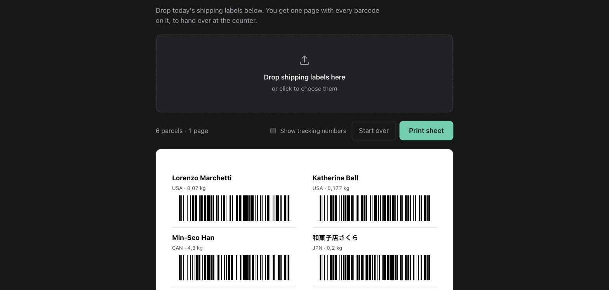

# Correos label sheet

Drag your **Correos** shipping labels onto a page, get **one A4 sheet with every barcode on
it**, and hand that over at the counter — instead of opening and printing each label PDF one
at a time.



It is a single self-contained HTML file. Open it, drop the PDFs on, press **Print**. Nothing
to install, no terminal, no account, no sign-up. The PDFs are read inside your browser and
never leave your computer.

> Built for **Correos (Spain)** labels specifically — Correos Exprés, CN22 customs, Paq
> Estándar, and the Correos labels produced by Sendcloud. It is not a general-purpose
> shipping-label tool and will not understand labels from other carriers.

## Using it

1. Download your labels as usual — they land in your Downloads folder.
2. Open `label-sheet.html`.
3. Drag the PDFs onto the page (or click to pick them).
4. Check the list, then press **Print**.

Each row shows who the parcel is for, where it is going and what it weighs, with the barcode
underneath. Two columns, about 16 parcels per A4 page, so 25 labels come out as 2 pages
rather than 25.

Anything it cannot read confidently is listed separately with the reason, so you know to
print that one the old way. It will never put a barcode on the sheet it could not verify.

**Tracking numbers** are hidden by default; there is a toggle in the toolbar. Turn them on if
the counter's scanner is having a bad day — the printed number is the only fallback.

## Building it

```bash
npm install
npm run build       # -> dist/label-sheet.html
npm test            # 53 tests
npm run typecheck
```

## Which labels work

| Label | Where it comes from | Barcode contains |
| --- | --- | --- |
| Correos Exprés | Mi Oficina | S10 tracking number (`LX554474175ES`) |
| Correos CN22 customs | Mi Oficina, international | S10 tracking number |
| Paq Estándar | Correos premium | parcel code (`Código de Bulto`) |
| Sendcloud | Sendcloud, upright or sideways | S10 tracking number |

Recipient names in any script are handled, including Japanese and Chinese.

Across a folder of 149 real labels, 148 are read correctly and 1 is correctly refused (an
address sheet with no barcode on it at all).

## Are the regenerated barcodes really the same?

The barcodes are drawn fresh rather than copied out of the PDF, so this is worth being sure
about. It was checked against the printed pixels: render each label at 600 dpi, read the bar
widths off a scanline, decode them, and compare with what this project produces for the same
parcel. **110 real labels, 110 payloads matched, 0 mismatches.**

Some come out bar-for-bar identical and some as a different-but-equivalent encoding, because
Code 128 allows several encodings of one string and Correos' own label generators disagree
with each other. The decoded value — the thing a scanner reads — is always the same.

## How it works

`extractLabel` does not hard-code coordinates per layout. It keys off structure that holds
across all of them: a `TO` / `Destinatario` marker sits beside the recipient block, the block
is a left-aligned column with the name first and the country last, and phone numbers and
delivery boilerplate live in other columns — so grouping by left edge separates them out.

Pure domain logic in `src/`, IO only at the edges:

| File | Role |
| --- | --- |
| `code128.ts` | Code 128 encoder (and a decoder used only by tests) |
| `barcodeSvg.ts` | symbol → SVG, sized in millimetres |
| `extractLabel.ts` | positioned text → a label, or a reported failure |
| `types.ts` | domain types |
| `pdfText.ts` | adapter — the only file that knows pdf.js exists |
| `browser/main.ts` | wiring: drag-and-drop, rendering, print |

Barcodes are 0.5 mm per module and 16 mm tall, each carrying its own 5 mm quiet zone, so
side-by-side symbols keep 10 mm of clear space as Code 128 requires.

## Development

```bash
npm test
npm run test:watch
npx tsx scripts/checkCorpus.ts ~/Downloads   # run the real pipeline over a folder of labels
```

`checkCorpus` is a smoke check rather than a test: it runs everything over a real directory
and flags whatever looks mis-read — a name that is really a street line, a missing country, a
label it could not parse.

### Fixtures

`tests/fixtures/*.json` are captures of real shipments with **names, addresses and phone
numbers replaced by invented ones**. Coordinates are untouched, so they still exercise the
real geometry of each layout. The source PDFs are personal data and are not committed;
`npm run fixtures` regenerates the JSON from PDFs placed in that folder.

### One gotcha worth knowing

The build refuses to emit any non-ASCII character. The app ships as a single HTML file with
no charset declaration, so a raw UTF-8 byte gets misread when the file is opened from disk —
which once silently broke a regex containing `ó` and made Paq labels unrecognisable. Write
non-ASCII as `\uXXXX` escapes in the source.
